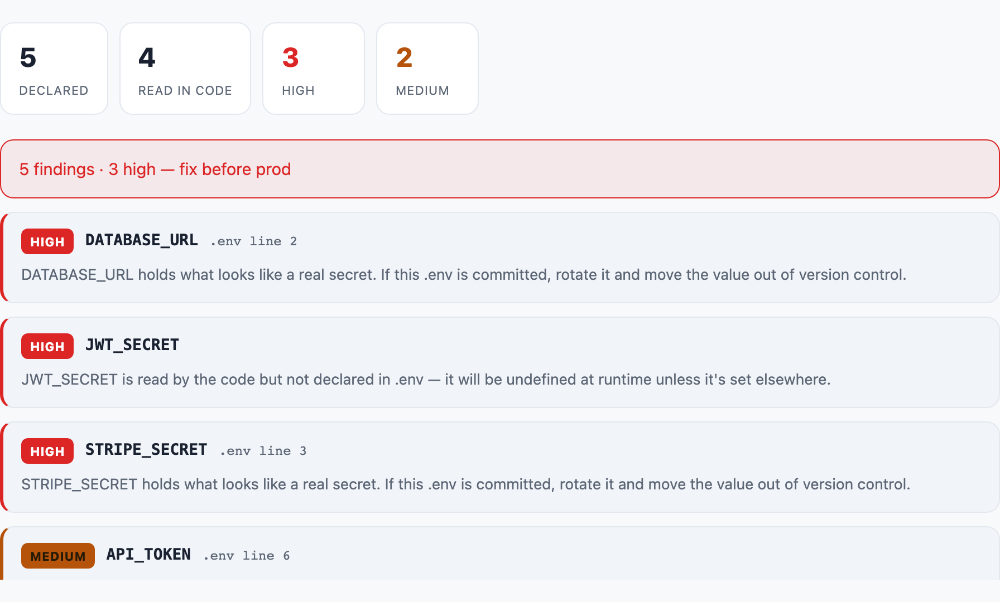

<p align="center">
  
</p>

<h1 align="center">envxray</h1>

<p align="center"><b>X-ray your .env before it breaks prod. Committed secrets, undeclared reads, dead config — caught in your browser.</b></p>

<p align="center">
  🇺🇸 English · <a href="README.id.md">🇮🇩 Bahasa Indonesia</a> · <a href="README.zh-CN.md">🇨🇳 简体中文</a>
</p>

<p align="center">
  
  
  
  
</p>

<p align="center">
  <a href="https://ryanda9910.github.io/envxray/"><b>→ open the tool</b></a>
</p>

<p align="center">
  
</p>

Two env bugs ship over and over: a secret sitting in a committed `.env`, and a
`process.env.SOMETHING` the code reads that nobody put in the `.env` — so prod boots
with `undefined` and falls over at the worst time. `.env.example` is supposed to
prevent the second one, and it's always out of date.

envxray takes your `.env` and the code that reads it, cross-checks them, and tells
you exactly what's wrong: which values look like **real committed secrets**, which
vars are **read but never declared**, which are **declared but never read** (dead
config or a typo), and which secret-named vars are **silently blank**. Then it
writes you a clean, redacted `.env.example`. It runs entirely in your browser —
your `.env` and your code never leave the tab, never hit a server.

## What it catches

| | |
|---|---|
| 🔴 **Committed secret** | a value that looks like a live key (`sk_live_…`, `ghp_…`, a JWT, a PEM, a long high-entropy blob) sitting in the `.env` — rotate it and get it out of version control |
| 🔴 **Read but undeclared** | `process.env.X` in the code with no `X` in the `.env` — `undefined` in production |
| 🟡 **Dead config** | declared in `.env`, never read — leftover, or a name the code reads under a different spelling |
| 🟡 **Blank secret** | a `*_SECRET` / `*_TOKEN` / `*_KEY` with an empty value — boots with a blank credential instead of failing fast |
| ✅ **Generated `.env.example`** | every var the code reads and the `.env` declares, values redacted, ready to commit |

It reads env access in **JS/TS** (`process.env`, `import.meta.env`), **Deno**,
**Python** (`os.environ`, `os.getenv`), **Ruby** (`ENV[]`), **PHP** (`$_ENV`,
`getenv`), and **shell / docker-compose** (`${VAR}`).

## Low false-alarm on purpose

Placeholder values (`your-api-key`, `changeme`, `xxxx`, `<password>`, `example`)
are **not** flagged as secrets. A short config value like `PORT=3000` is not a
secret. With no code pasted, only the committed-secret check runs — it won't
invent drift findings it can't verify. The [tests](test/envxray.test.mjs) lock all
of this in.

## Use it

Just open **[the tool](https://ryanda9910.github.io/envxray/)** and paste. No
build, no account, no upload. Works offline once loaded.

The detection engine ([`envxray.js`](envxray.js)) is a zero-dependency module that
runs in the browser and in Node, so you can also script it:

```js
const { analyze } = require("./envxray.js");
const r = analyze({ env: envText, code: sourceText });
console.log(r.findings, r.example);
```

## Why in the browser

A `.env` is the most sensitive file in your repo. A tool that asks you to paste it
into a server is the last tool you should use on it. envxray does everything
client-side — open the page offline and it still works. Verify: it makes no network
requests after the page loads.

## License

MIT.
